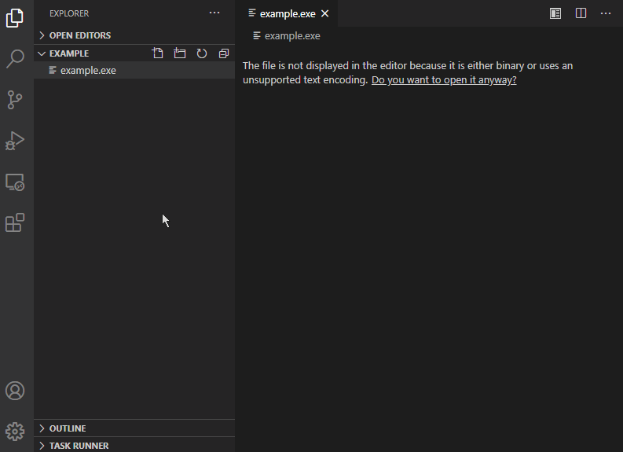

# exe Runner

**exe Runner** is an Visual Studio Code extension that allows you to easily run `.exe` files.

## Features

* Run `.exe` files by clicking button right of the tab bar
* Run `.exe` files from the file explorer context menu for `.exe` files
* Run `.exe` files from the editor context menu for `.exe` files
* Use the command `Run Executable` to run `.exe` files

## Example

