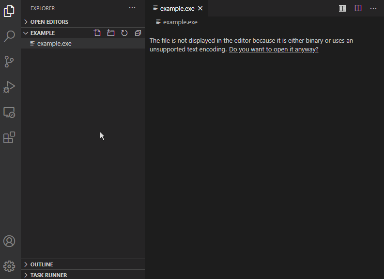

# exe Runner

Run `.exe` files in the Visual Studio Code terminal with a single click. Uses a compatibility layer, such as `wine`, on non-Windows platforms.

## Features

* **One-click execution** - Run the current `.exe` file by clicking the button right of the tab bar
* **Context menus** - Run any `.exe` file from their file, editor tab, or editor context menu
* **Run with arguments** - Press [Alt] while selecting a command to run `.exe` files with arguments
* **Command Palette** - Run the current `.exe` with the command `Run Executable` or `Run Executable With Arguments`
* **Cross-platform support** - On non-Windows platforms, invoke a compatibility layer, such as `wine`, to run `.exe` files
* **Configurable** - Options to **clear previous output** and to **change the directory** to the `.exe` file's before running

## Example

